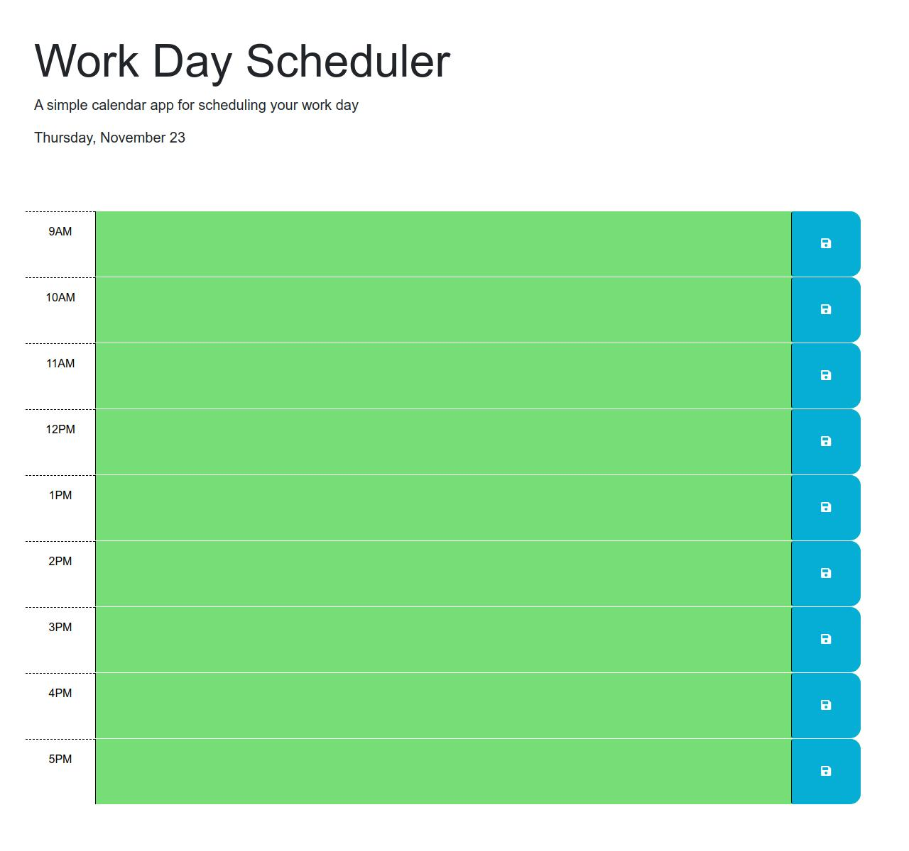

# Work Day Scheduler

## Description

This project allows you to schedule your work day from 9AM to 5PM. It uses the DayJS module to display the date and color the website dynamically.

## Installation

N/A

## Usage

This website can be viewed at https://artificialair.github.io/work-day-scheduler.  Type into the text boxes and click the save button to try it out!

The following is a screenshot of the finished website.

## Credits

N/A

## License

Please refer to the LICENSE in the repo.